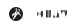

### Hi there 👋

⚡ Freelance Full-Stack Software Engineer based in Austria.

💬 Get in touch at <a href="mailto:hello@fabianuntermoser.com">hello@fabianuntermoser.com</a> or see my [🌎 Website](https://fabianuntermoser.com/).

🎓 MSc of Multimedia Technology at the University of Applied Sciences in Salzburg, Austria.

📝 I write digital notes at [fabianuntermoser.com](https://www.fabianuntermoser.com/).

🛠️  I enjoy scripting & ricing. Checkout my [dot-files](https://gitlab.com/FabianUntermoser/dot-files).

---
## Technology
### Code & Build

### DevOps

### Monitor & Security

### Data & Messaging

### Tools

<!--

- 🔭 I’m currently working on ...
- 🌱 I’m currently learning ...
- 👯 I’m looking to collaborate on ...
- 🤔 I’m looking for help with ...
- 💬 Ask me about ...
- 📫 How to reach me: ...
- 😄 Pronouns: ...
- ⚡ Fun fact: ...
-->
